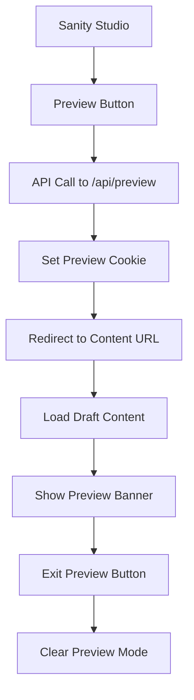

# CMS Integration with Sanity

This document explains how the StarwayTrasporti website integrates with Sanity CMS, including content management, preview mode, and deployment considerations.

## Overview

The website uses Sanity as a headless CMS to manage:
- Page content (homepage, about, services, etc.)
- Location data (offices, warehouses, service points)
- Navigation menus
- Testimonials
- Media assets

## Content Architecture

### Schemas

The CMS includes several content schemas:

#### Core Content
- **Page**: Main page content with sections and SEO metadata
- **Section**: Reusable content sections (hero, services, stats, CTA)
- **MediaAsset**: Images and media with optimization metadata

#### Business Content
- **Location**: Office locations, warehouses, and service points
- **Testimonial**: Customer reviews and testimonials
- **NavigationItem**: Menu items and navigation structure

#### Section Types
- **HeroSection**: Landing page hero with parallax backgrounds
- **ServicesSection**: Service listings with icons and descriptions
- **StatsSection**: Statistics and metrics display
- **CTASection**: Call-to-action sections with buttons
- **ContentSection**: Rich text content with embedded media

### Content Fetching

Content is fetched using GROQ queries through the Sanity client:

```javascript
// Server-side fetching with caching
import { getHomepage, getLocations } from '$lib/server/sanity/content.js';

const homepage = await getHomepage('en', { previewMode: false });
const locations = await getLocations({ previewMode: false });
```

### Caching Strategy

- **Server-side caching**: 5-minute cache for published content
- **CDN caching**: Sanity CDN for images and assets
- **Preview mode**: No caching for draft/preview content

## Preview Mode

The website supports preview mode for draft and scheduled content:

### Enabling Preview Mode

1. **From Sanity Studio**: Use the preview button in the document toolbar
2. **Manual URL**: Add `?preview=true&id=<document-id>` to any URL
3. **API Endpoint**: POST to `/api/preview` with authentication

### Preview Mode Features

- **Draft Content**: View unpublished changes
- **Scheduled Content**: Preview content before publish date
- **Visual Indicator**: Yellow banner shows when preview is active
- **Easy Exit**: One-click exit from preview mode

### Preview Mode Flow



## Component Architecture

### CMS-Aware Components

The website uses CMS-aware components that can fall back to static content:

```svelte
<!-- HeroCMS.svelte -->
<script>
  let { heroData = null } = $props();
  
  // Fallback content when no CMS data
  const fallbackHero = {
    title: m.hero_title(),
    subtitle: m.hero_subtitle(),
    // ...
  };
  
  const hero = heroData || fallbackHero;
</script>
```

### Section Mapping

CMS sections are mapped to Svelte components:

- `heroSection` → `HeroCMS.svelte`
- `servicesSection` → `ServicesCMS.svelte`
- `statsSection` → `StatsCMS.svelte`
- `ctaSection` → `CTACMS.svelte`

## Internationalization

Content supports multiple locales:

- **English** (default): `en`
- **Italian**: `it`

Each content type includes a `locale` field to manage translations.

## Image Optimization

Images are automatically optimized through Sanity's image pipeline:

```javascript
import { getImageUrl } from '$lib/utils/sanity.js';

// Optimized image URL
const imageUrl = getImageUrl(image, {
  width: 800,
  height: 600,
  format: 'webp',
  quality: 85
});
```

### Responsive Images

The utility functions generate responsive image sets:

```javascript
const imageSet = getOptimizedImageSet(image, [400, 800, 1200, 1600]);
// Returns: { src, srcSet, sizes }
```

## Publishing Workflow

### Content States

1. **Draft**: Work-in-progress content (not visible on live site)
2. **Published**: Live content visible to all users
3. **Scheduled**: Content with future publish date

### Preview vs Live

- **Preview Mode**: Shows draft/scheduled content
- **Live Mode**: Shows only published content
- **Caching**: Preview mode bypasses all caches

## Environment Configuration

### Required Environment Variables

```bash
# Sanity Configuration
PUBLIC_SANITY_PROJECT_ID="your-project-id"
PUBLIC_SANITY_DATASET="production"
SANITY_PROJECT_ID="your-project-id"
SANITY_DATASET="production"
SANITY_API_VERSION="2024-01-01"
SANITY_TOKEN="your-api-token"

# Preview Mode
SANITY_STUDIO_PREVIEW_URL="https://your-website.com"
SANITY_STUDIO_PREVIEW_SECRET="your-preview-secret"
```

### Development vs Production

- **Development**: Uses localhost URLs for preview
- **Production**: Uses production domain for preview
- **Token Security**: Preview tokens should be kept secure

## API Endpoints

### Preview Management

- `POST /api/preview`: Enable preview mode
- `GET /api/exit-preview`: Disable preview mode

### Authentication

Preview mode requires authentication via the `SANITY_TOKEN` environment variable.

## Best Practices

### Content Structure

1. Use consistent naming conventions
2. Include SEO metadata for all pages
3. Optimize images before upload
4. Test content in preview mode before publishing

### Performance

1. Leverage Sanity's CDN for images
2. Use appropriate caching strategies
3. Minimize GROQ query complexity
4. Implement proper error handling

### Security

1. Secure preview tokens
2. Validate content before rendering
3. Sanitize user-generated content
4. Use HTTPS in production

## Troubleshooting

### Common Issues

1. **Preview not working**: Check token configuration
2. **Images not loading**: Verify project ID and dataset
3. **Caching issues**: Clear cache or disable for debugging
4. **CORS errors**: Check domain configuration

### Debug Mode

Enable debug logging by setting:

```bash
DEBUG=sanity:*
```

## Migration and Deployment

### Content Migration

When deploying schema changes:

1. Test in development dataset first
2. Deploy schema changes to production
3. Migrate existing content if needed
4. Update website code to handle new schema

### Deployment Checklist

- [ ] Environment variables configured
- [ ] Sanity schema deployed
- [ ] Website build successful
- [ ] Preview mode tested
- [ ] Content published
- [ ] Cache cleared if needed

## Support and Resources

- [Sanity Documentation](https://www.sanity.io/docs)
- [GROQ Query Language](https://www.sanity.io/docs/groq)
- [SvelteKit Integration](https://kit.svelte.dev/docs/load)
- [Image Optimization](https://www.sanity.io/docs/image-url)
